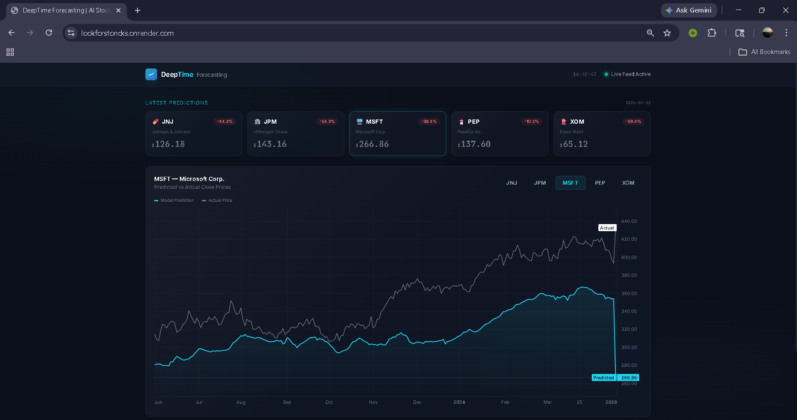
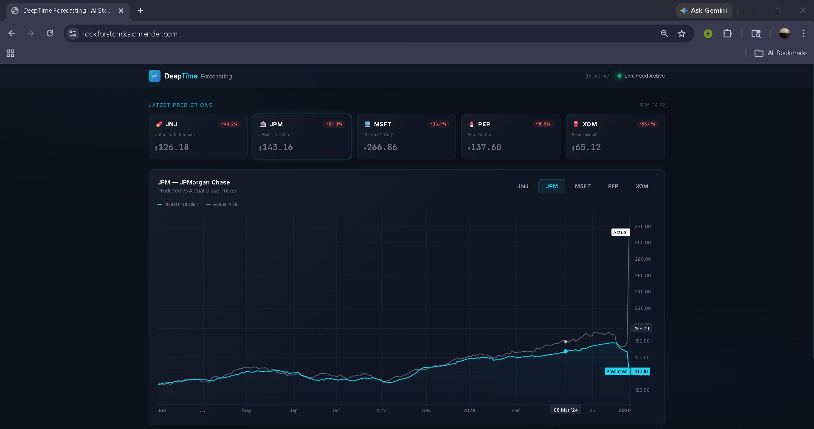

# DeepTime Forecasting

## Overview
DeepTime Forecasting is a production-grade, self-updating stock prediction web application. It fetches live market data, predicts closing prices for 5 major stocks (**AAPL, JNJ, JPM, MSFT, PEP**) using a custom PyTorch model, and displays them on an interactive dashboard with TradingView charts.

## Key Features
- **Advanced PyTorch Architecture:** Uses a custom neural network combining GRU layers and Multi-Head Attention to process time-series sequences.
- **High-Accuracy Returns Pipeline:** Predicts percentage returns rather than raw prices (scaled via `StandardScaler`), achieving highly robust predictions with ~1% error rates regardless of market price levels.
- **Automated Daily Inference:** A GitHub Actions workflow runs every Tuesday–Saturday at 4:00 AM IST (22:30 UTC) to fetch the finalized end-of-day (EOD) market tapes, generate new predictions, and update the dataset.
- **Live Market Data:** Integrates with [Twelve Data API](https://twelvedata.com) to fetch reliable, up-to-date historical market data.
- **Flask Backend:** A robust backend serving historical stock data and the latest model predictions via RESTful APIs.
- **Interactive Dashboard:** Features an aesthetic, responsive frontend utilizing interactive TradingView financial charts to visualize stock trends and forecasts.
- **Optimized Deployment:** Containerized with Docker and configured with a CPU-only PyTorch build to optimize memory footprint, enabling deployment on Render's free tier.

## Tech Stack
- **Backend:** Python, Flask, Gunicorn
- **Machine Learning:** PyTorch (CPU-only), scikit-learn, joblib
- **Data Processing:** Pandas, NumPy, Twelve Data API
- **Frontend:** HTML, JavaScript, TradingView Charts
- **DevOps:** Docker, GitHub Actions, Render

## Directory Structure
- `backend/`: Contains the Flask application (`app.py`), routing logic, and model loader.
- `src/`: Core machine learning pipeline including model definition (`model.py`), data pipeline, and training/evaluation scripts.
- `scripts/`: Operational scripts, such as `daily_predict.py`, which is executed by GitHub Actions.
- `data/`: Storage for processed data arrays and daily JSON predictions.
- `models/`: Saved PyTorch model weights and data scalers.
- `.github/workflows/`: CI/CD pipelines (e.g., automated daily predictions).

## Running Locally

### Prerequisites
- Python 3.11+

### Setup
1. **Clone the repository:**
   ```bash
   git clone https://github.com/Viraj-brn/Stock-Predictor.git
   cd Stock-Predictor
   ```

2. **Create a virtual environment and install dependencies:**
   ```bash
   python -m venv venv
   source venv/bin/activate  # On Windows: venv\Scripts\activate
   pip install -r requirements.txt
   ```

3. **Set up your API key:**
   - Get a free API key from [Twelve Data](https://twelvedata.com)
   - Create a `.env` file in the project root:
   ```bash
   TWELVE_DATA_KEY=your_api_key_here
   ```

4. **Run the Flask application:**
   ```bash
   python backend/app.py
   ```

5. **View the Dashboard Local:**
   Open your browser and navigate to `http://127.0.0.1:5000/`.

6. **View the Live Deployment:**
   The application is deployed at: `https://lookforstoncks.onrender.com/`.

### Using Docker
To build and run the Docker container locally:
```bash
docker build -t deeptime-forecasting .
docker run -p 5000:5000 deeptime-forecasting
```

## Deployment
The application is pre-configured for deployment on Render. It uses Gunicorn with a single worker (`-w 1`) and PyTorch thread limits (`OMP_NUM_THREADS=1`) to stay within strict free-tier RAM limits.


## Screenshots of the Dashboard



